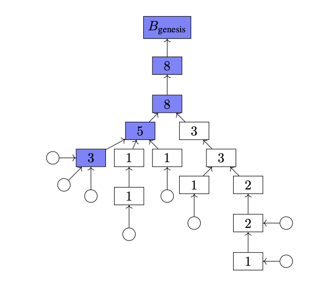

# Casper FFG & LMD GHOST

## 从一个问题切入

有时候, 写代码就想做菜, 咸了加水, 淡了撒盐. 对于一个知道做菜的人(设计协议的人), 只需尝一口就知道什么时候应该加水, 什么时候应该加盐. 而对于学习做菜的人(学习协议的人, 你, 我)往往看的云里雾里, 为什么要在这个时候撒盐?为什么要在这个时候加水?想要倒着想明白为什么当然困难.

因此我建议大家从一个问题切入, 这样才能正着明白为什么要加水, 为什么要加盐, 以及 Casper FFG 设计的伟大之处.

这个问题就是: **为什么 PBFT 要有两次投票? 一次不够吗?**

## Tendermint

在此之前我们先回顾一下经典共识算法 Tendermint.

Tendermint 分为四个主要阶段, `proposal`, `prevote`, `precommit`, `finalize`. 在`proposal`阶段, 被选举出来的验证人会成为提议人, 然后提议并广播一个区块以及他对这个区块的签名. 收到提议区块以及签名的其他验证者在验证其合法性以后会进入下一个阶段`prevote`. 在这个阶段, 所有验证者都会为提议区块签名, 形成一个`prevote`投票, 然后广播. 同时他们也会收集来自其他验证者的`prevote`投票. 当收集到的`prevote`投票到达 +2/3 时, 就会进入下一个阶段`precommit`. 在这个阶段, 验证者重复上个阶段的操作, 构造`precommit`投票并广播, 同时收集`precommit`投票. 当收集到的`precommit`投票到达 +2/3 时, 就会进入最后一个`finalize`阶段. 在这个阶段, 区块会被最终敲定.

如果 Tendermint 只有一轮投票呢? 可以设想可能会出现以下场景.

假如存在 A B C D E F 六个验证者, 这时候需要收集到 5 张投票才达到 +2/3 共识.

在第一轮, A 是提议人, 提议了区块 a, 所有验证者包括 A 自己都为 a 投了 `prevote` 投票. 但是由于网络延迟, 只有 A 自己收集到了足够的投票, 其余验证者没有. 这时候 A 会将 a 区块敲定, 可是其他验证人会因为迟迟没有收到足够的投票而进入下一轮. 在第二轮, B 是提议人, 而 B 提议了 b 区块, 这时剩下的五个验证人又全部为 b 区块投了 `prevote` 投票并且都收集到了彼此的投票. 那么此时剩下的五个验证人会敲定 b 区块, 从而引起区块链分叉.

解决方案也很简单, 两轮投票就可以了, 第一轮投票达到 +2/3 时, 意味着 +2/3 的验证者已经收到了提议消息, 不会存在上面那种因为网络延迟而导致有的验证者收到, 有的验证者没有收到, 从而导致分叉的情况.

> NOTE: 其实就算两轮投票, 依然会有一种极端情况可能导致分叉, Tendermint 为了解决这个问题加入了锁机制, 但这不是本文的重点, 不展开讨论

## Casper FFG & LMD GHOST

在 Casper FFG(Casper the Friendly Finality Gadget) 中, 每 12 秒为一个槽位(Slot), 每 32 个槽位为一个世代(Epoch), 每个世代的第一个槽位以及最后一个槽位被称为检查点(Checkpoint). 每进入一个新的世代, 都会从所有验证者中, 依据算法选取一个验证者委员会(Committee), 再从这个集合中依据算法选取 32 个提议者(Proposer)对应这个世代的 32 个槽位.

> NOTE: 其实验证者委员会还会被分配到不同的子网(Subnet), 并且每一个子网都会分配一个聚合者(Aggregator), 负责聚合签名. 每一个子网对应一个分片, 虽然现在还没有分片, 但这是为了以后做准备.

Casper FFG 提议区块时选取父级区块的逻辑与传统区块链略微有些不同, 提议人会根据 LMD GHOST 分叉选择算法选择他认为最合法的区块当作父级区块. 简单来说, 会选择验证人投票权重最高的分叉.



Casper FFG 在投票时, 不是对单一区块投票, 而是对两个检查点投票, 这两个检查点可能跨越了一个或多个世代. 这个世代的每个区块都会为之前的世代收集来自验证人的投票. 每一张投票的结构(AttestationData)如下:

```
class AttestationData(Container):
    slot: Slot
    index: CommitteeIndex
    # LMD GHOST vote
    beacon_block_root: Root
    # FFG vote
    source: Checkpoint
    target: Checkpoint
```

其中:

- `slot` 是验证者被分配到的槽位, **并不代表验证者为某一个槽位投票**
- `index` 是验证人所在委员会的下标
- `beacon_block_root` 是验证人根据 LMD GHOST 算法选出来的分叉的最后一个块的 root hash
- `source` 是验证人本地的最后一个处于 `justified` 状态的世代的最后一个槽位
- `target` 是验证人本地当前世代的第一个槽位

每个世代有三种状态, `unsafe`, `justified` 和`finalized` . 当世代的状态是 `justified` 状态时意味着这个世代已经得到了第一次 +2/3 共识, 不太可能被回滚. 当世代的状态是 `finalized` 状态时意味着这个世代已经得到了两次 +2/3 共识, 已被敲定. 下面以一个例子来讲述整个过程, 为了简单起见, 这个例子中所有的区块的父级区块都是上一个区块并且不存在恶意节点, 以及其他意外状况.

**世代 0**

槽位: 0 ~ 31

验证者行为: 根据标准定义, 创世块既是 `justified` 状态, 也是 `finalized` 状态. 因此在世代 0, 所有投票中的`source` 和 `target` 都为 0.

结果: 在槽位 0 ~ 31 中的所有区块都是 `unsafe` 状态.

**世代 1**

槽位: 32 ~ 63

验证者行为: 此时最后一个 `justified` 的世代的最后一个槽位依然是 0, 但是当前世代的第一槽位已经变成了 32.因此 `source` 为 0, `target` 为 32.

结果: 在槽位 0 ~ 31 中的所有区块由于已经收到了第一次 +2/3 共识, 因此世代 0 的状态变为 `justified`. 而新出的 32 ~ 63 由于还没有经历过共识, 因此状态是 `unsafe`.

**世代 2**

槽位: 64 ~ 95

验证者行为: 同上, 不难得出 `source` 为 32, `target` 为 63.

结果: 在槽位 32 ~ 63 中的所有区块由于已经收到了第一次 +2/3 共识, 因此世代 1 的状态变为 `justified`. 与此同时, 世代 1 得到共识意味着世代 0 间接的得到了第二次 +2/3 共识, 因此世代 0 的状态变为 `finalized`. 最后, 新出的 64 ~ 95 由于还没有经历过共识, 因此状态是 `unsafe`.

**世代 3**

依次类推...

至此, Casper FFG 巧妙的通过给下一个世代投票间接的让上一个世代得到了第二轮 +2/3 共识, 从而解决了最一开始的问题.

## 总结

与 Tendermint 相比, Casper FFG 至少有以下几个优点:

- 减少了验证人的负担</br>
  对每个验证人而言, 在 Tendermint 中, 32 个区块需要 64 张投票, 而在 Casper FFG 中, 只需要 1 张投票. 广播投票, 验证投票的密码学合法性等等一系列操作的负担减少了 64 倍.
- 减少了系统复杂度</br>
  Tendermint 为了解决某些极端情况下可能导致分叉的问题, 增加了诸如 `validBlock` 和 `lockedBlock` 等逻辑. 但在 Casper FFG 中不需要额外的复杂逻辑.

> NOTE: Ethereum2.0 用了 BLS 聚合签名, 使区块体积比 Cosmos 更小, 这也算一个优点但这不算 Casper FFG 的优点, 因此不归类.

当然, 有好处也有坏处, 最大的坏处就是 Casper FFG 不能和 Tendermint 一样做到出块即敲定. 处于 `unsafe` 状态的区块随时可能被回滚. 从一笔交易被打包到这笔交易被敲定, 至少要等两个世代, 也就是差不多 12 分钟.
