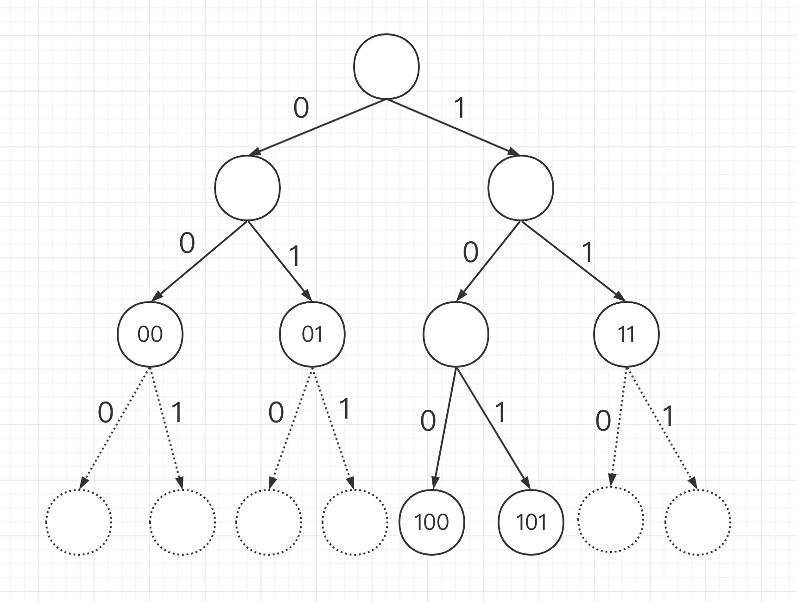
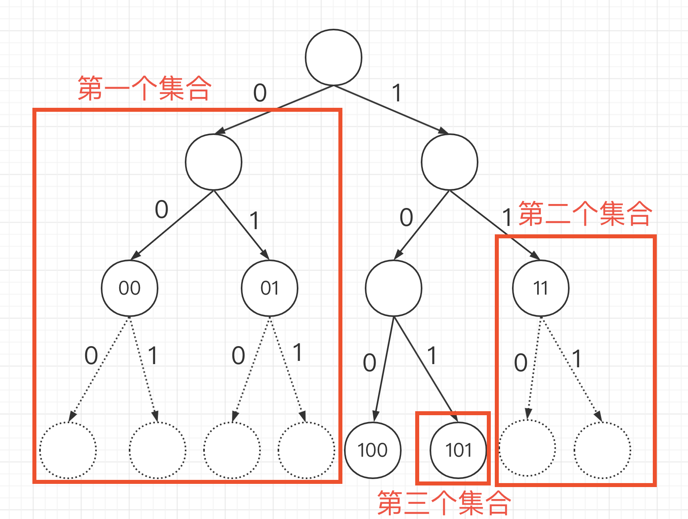
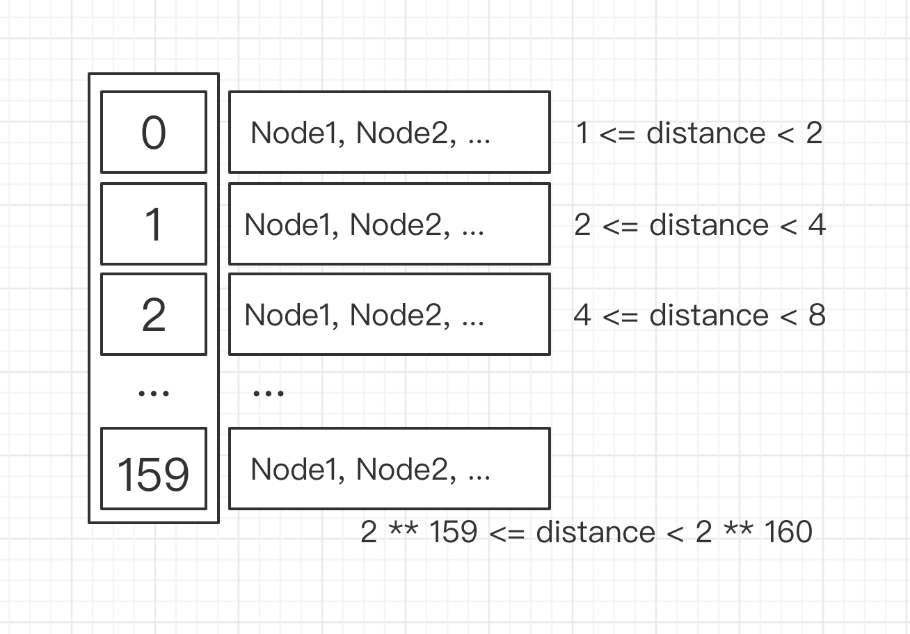

# KadDHT 与 KBucket

## 节点 ID

在 Kademlia 中, 所有节点都有一个身份 ID,
这个 ID 一般是内容的哈希结果. 在 Libp2p 中, 这个值为节点公钥哈希(此处节点的公私钥只是用来加密解密 p2p 节点之间的通信, 同时确保数据不被篡改, 与区块链无关). Kademlia 中的哈希算法使用了 SHA1, 因此身份结果固定为 160bit.

## 节点之间的逻辑距离

在 Kademlia 中, 约定两个节点之间的距离为两个节点的 ID 进行异或运算(XOR)的结果, 这个结果越小则两个节点越近, 反之越远.

## 路由表结构

在路由表中, 每个节点的身份 ID 将会被截取为最短唯一前缀. 比如有 ID 为`0b000...001`的节点 A, ID 为`0b000...010`的节点 B 和 ID 为`0b1111...1111`的节点 C, 那么此时 A 的 ID 就会被截取为`0b000...0`(159 个 0), B 的 ID 就会被截取为`0b000...1`(158 个 0 加一个 1), C 的 ID 就会被截取为`0b1`.

Kademlia 会构建一个二叉树, 然后将所有节点放进这个二叉树, 规则如下

- 从根节点和节点 ID 的第一位开始依次遍历

- 如果当前二叉树的节点已经有节点存在, 则先把原来的节点放入更下一层, 否则直接放入目标节点

- 如果节点 ID 的这一位是 0, 则将目标节点放入左子树, 继续遍历. 如果节点 ID 的这一位是 1, 则将目标节点放入右子树, 继续遍历

(注: 图中五个节点 ID 分别为`0b00...`, `0b01...`, `0b100...`, `0b101...`, `0b11...`)

所以 Kademlia 二叉树的深度最大为 160, 因为节点身份 ID 的最大位数是 160.

## 路由表拆分

实际使用中, 每个节点不会保存所有其他节点(最多有 2 \*\* 160 个), 而是根据算法将 Kademlia 二叉树拆分, 只保留一部分. 具体算法为从根节点开始拆分, 将不包含本节点的子树作为一个集合, 之后在继续拆分包含本节点的子树, 直到只剩下本节点.

(注: 假设本节点的 ID 为`0b100...`)

所以最多的情况下, 可以有 160 个集合.

## K 桶

在完成路由表拆分后, 只保留每个集合中的 N 个节点, 其中 N 便是 K 桶的大小. 然后依据节点的逻辑距离, 所有集合排序, 即为 K 桶.

注意, 此时集合之间按照逻辑距离排序, 但是集合内部没有顺序, 只是一个队列. 并且, 在这种结构下, 每个节点的 K 桶保留较多离自己近的节点, 但离自己远的节点也不至于一个都没有.

## K 桶的更新

K 桶会通过一下几种方式更新自己以维护稳定性

- 向别的节点发送 FIND_NODE 方法, 获取新的节点信息, 记入 K 桶

- 接受别的节点发送的 FIND_NODE 方法, 返回与目标节点最近的若干个几点的同时, 将对方记入 K 桶

- 使用 PING 方法轮询检查所有在 K 桶中的节点, 如果节点无响应则将他移除 K 桶

- 在 Kademlia 中, 还有 Random walk 逻辑, 每隔一段时间就会生成一串随机字符, 然后对随机字符进行哈希, 最后将哈希结果作为目标节点 ID, 使用 FIND_NODE 方法寻找

当一个节点要加入 K 桶时, 先根据逻辑距离找出对应的集合, 如果集合未满, 则直接加入集合, 如果集合已满, 则对集合队列中第一个节点进行一次 PING, 如果第一个节点正常回复则把第一个节点移到队列末尾并忽略新的节点, 如果第一个节点没有正常回复, 则用新的节点取代第一个节点. 此举是为了优先选择链接时间长的节点.

## K 桶节点寻找

当本节点想要根据哈希寻找另一个节点时, 会从本地的 K 桶中找出离目前节点逻辑距离最近的 N 个节点, N 一般为 3. 然后同时想这三个节点发送 FIND_NODE 方法, 并传入目标节点的哈希. 之后向获取的结果继续发送 FIND_NODE 方法, 如此往复, 直到寻找到目标节点.

FIND_NODE 每次返回的节点总是 K 桶中离目标节点最近的若干个节点, 所以每次查询都会离目标节点更近一步. 只要目标节点在 p2p 网络中, 经过数此寻找后总可以找到目标节点.

## KadDHT 内容路由

当有发布者想要发布资源时, 会先计算资源文件的哈希, 然后从自己的 K 桶中找出离文件哈希最近的 N 个节点(一般是 3 个), 同时向他们发送 PUT_VALUE 方法. 收到 PUT_VALUE 请求的节点会把发布的数据存到本地, 同时返回自己的 K 桶中离文件哈希较近的若干节点. 发布者收到返回后, 继续向返回结果发送 PUT_VALUE 方法, 并如此往复, 直到达到设置中的超时时间或者最大节点数量.

当有下载者想要下载资源时, 会根据需要下载的文件的哈希, 从自己的 K 桶中寻找离文件哈希最近的 N 个节点(一般是 3 个), 同时向他们发送 GET_VALUE 方法. 收到 GET_VALUE 请求的节点会检查本地数据库, 如果有这个资源就返回, 同时还会在自己的 K 桶中寻找离文件哈希较近的若干节点并返回. 下载者收到返回结果后, 继续向返回结果发送 GET_VALUE 方法, 直到达到超时或者获取到要下载的资源.
