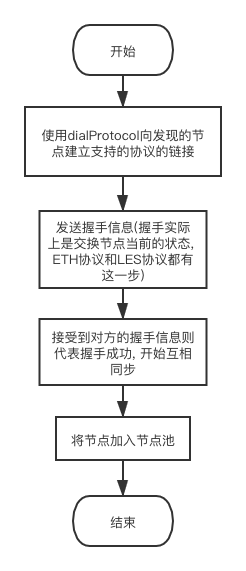
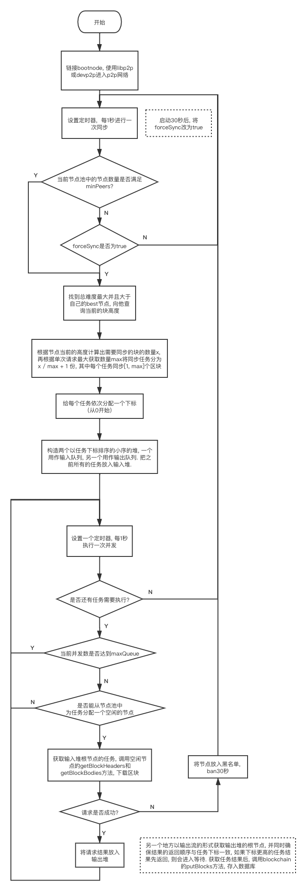

# ethereumjs-client

ethereumjs-client 是以太坊的 js 实现, 但目前还在开发中, 功能相当不完善, 只实现了 p2p 网络及区块同步逻辑, 交易池, 执行交易等功能都还没实现.

---

## p2p 网络

### p2p 模块

ethereumjs-client 提供了两种 p2p 网络形式, 使用 KadDHT 的 libp2p 模块以及使用 DPT(Distributed Peer Table, 用于节点发现), RLPx(用于节点之间传输信息) 的 ethereumjs-devp2p 模块, 在配置选项中选择即可控制其开启. 前者的原理已经在[另一篇文章](https://github.com/samlior/blog/blob/master/blog/KBucket.md)中介绍, 后者可以参考[这里](https://github.com/ethereum/devp2p).

### p2p 通信协议

目前的版本只实现了 ETH(Ethereum Wire Protocol) 以及 LES(Light Ethereum Subprotocol)这两个协议的部分方法. 前者是全节点之间的通信协议, 而后者是专门用于轻节点的. 两者的主要区别是在于

- 前者会在节点之间同步 pendingTransaction, 而后者不会同步 pendingTransaction, 因为轻节点只同步区块, 不会执行 pendingTransaction
- 后者比前者多了一个 flowControl 逻辑, 用于控制轻节点的并发. 大概的意思是全节点在为轻节点服务的时候, 会给每个链接的轻节点分配一个额度, 轻节点的每次请求都会依据请求类型的不同消耗这个额度, 随时间的推移这个额度会自动增加, 轻节点只能在额度还有剩余的时候发起请求, 不然会被全节点 ban

### 代码结构

- `net/peer/peer.ts` 实现了 Peer 类, 对一个远程节点进行封装. 两个子类分别是`libp2ppeer`和`rplxpeer`, 分别对应两个 p2p 模块. 底层模块不同导致调度, 初始化的时候均不相同, 因此需要两个不同的子类来实现.

- `net/peer/libp2pnode.ts` 仅仅是对 LibP2P 的类进行了一些自定义, 传入一些设置.

- `net/protocol/protocol.ts` 实现了 Protocol 类, 有两个子类`ethprotocol`和`lesprotocol`, 分别对应上面说的两种 p2p 通信协议. 主要作用是编码和解码通信协议的信息.

- `net/protocol/flowcontrol.ts` 实现了 LES 协议的轻节点并发控制逻辑.

- `net/protocol/sender.ts` 对节点对接收, 发送小小进行了封装, 有两个子类`libp2psender`和`rplxsender`, 分别对应两个模块.

- `net/protocol/boundprotocol.ts` 对 Protocol 类进行了再次封装. 里面包含了一个请求队列, 当本地节点发起请求时, 会向请求队列中注册一个 Promise 用于回调, 等请求结果返回后, 找出对应等 Promise, 并 resolve.

- `net/server/server.ts` p2p 网络的调度类, 上层逻辑只和 server 类交互.

- `net/peerpool.ts` 节点池, 每个节点建立链接后就会加入节点池. 节点池中的节点有空闲和使用中两个状态, 同步区块时会向节点池请求空闲的节点.

### 逻辑流程

大部分逻辑以及由 libp2p 及 ethereumjs-devp2p 实现, 因此这里的调度逻辑并不复杂

---

## 区块同步

### 代码结构

- `sync/sync.ts` 实现了 Synchronizer 类, 用于调度区块同步, 两个子类`fullsync`, `lightsync`分别对应全同步和轻同步.

- `sync/fetcher/fetcher.ts` 实现了 Fetcher 类, 具体的同步逻辑, 每次同步时就创建一个对象, 同步完成后就删除这个对象. 两个子类`blockfetcher`和`headerfetcher`分别对应全同步和轻同步. 里面包含一个输入任务堆和一个输出任务结果堆, 全部按任务下标由小到大排序, 并且还包含一个并发池, 轮询开始并发任务. 这样设计的目的是, 开启并发的同时保证任务结果的返回顺序和输入顺序一致.

### 逻辑流程

