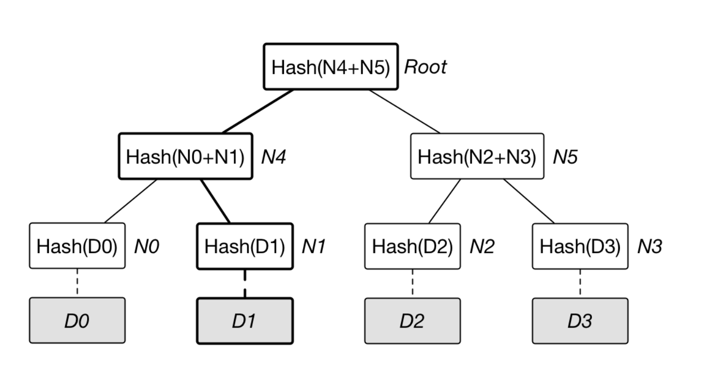
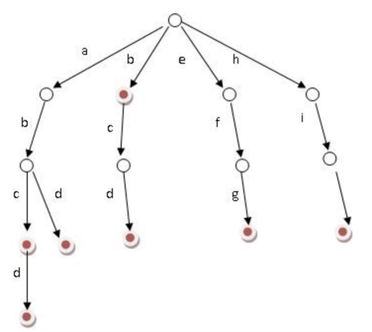
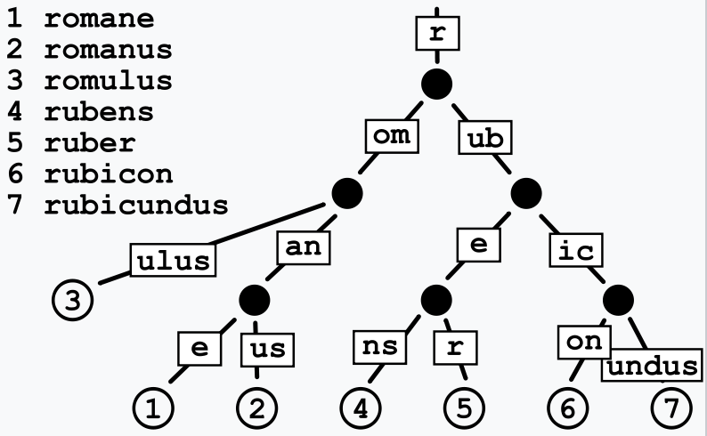

# 默克尔树

默克尔树是一种典型的二叉树结构，由一个根节点、一组中间节点和一组叶节点组成

## 默克尔树的结构



## 默克尔证明

在上图中要证明 D1 节点存在, 证明者只需要提供 D1 的下标, Root 以及 N0, N1 和 N5.</br>
而验证者只需根据下标及各个中间节点的值, 还原出默克尔树, 再计算 Root 是否一致

# 前缀树



根据图片不难理解, 前缀树只是依据元素的前缀拆分而成的树,</br>
但可以注意到这种结构存在一定的优化空间, 比如图中的 `b` -> `c` -> `d` 路径可以压缩成一个节点,</br>
又比如 `a`, `b`, `e`, `h` 这种处于同层级的可以横向压缩成一个节点

# 基数树(压缩前缀树)



基数树是前缀树的优化版本

# merkle-patricia-tree

## merkle-patricia-tree 的结构


共有三种节点

- `extension node` 扩展节点, 相当于基数树中的压缩节点, 包含路径信息, 以及值
- `leaf node` 叶节点, 相当于基数树中位于末端的压缩节点, 包含路径信息, 以及值
- `branch node` 分支节点, 相当于基数树中统一层级的压缩节点再次压缩到一起, 最多可以包含 `0` - `f` 共 16 个子节点, 也可以包含值

每种节点在 leveldb 数据库中的储存形式都是以自身 RLP 编码的哈希为键, 以自身 RLP 编码为值,</br>
同时, 父节点存储子节点信息的形式都是记录子节点的 RLP 编码的哈希,</br>
比如图中最上方扩展节点中`next node`的值就是下方分支节点的 RLP 编码的哈希

可以注意到, 要通过一个 Root 节点的哈希值以及一串路径, 查询到路径对应的值需要在 leveldb 数据库中进行多次查询,</br>
比如查询`a77d397`所对应的值需要经过 5 次查询,</br>
并且, 即使路径长度一样, 需要经历的查询次数也不一致. 这取决于树中的元素的总量, 元素的总量的总量越多, 需要经历的查询次数也会越多

## merkle-patricia-tree 的修改

当`a77d397`的余额发生变化时(减少了 0.01 ETH), 他的 RLP 编码及 RLP 编码的哈希都会变动, 并且, 从 Root 节点到`a77d397`所在的叶节点的路径上的所有节点的 RLP 编码及 RLP 编码的哈希都会变动.</br>

但是, 在完成一次修改后, 并不是删除旧的节点, 然后用新的节点取而代之, 而是保留旧的节点, 同时插入新的节点.</br>
在修改完成后, 数据库中同时存在新旧两颗树.</br>
如果此时通过旧的 Root 节点的哈希以及路径`a77d397`可以查询旧的叶节点, 旧的叶节点中余额仍旧为 0.12ETH.</br>
如果此时通过新的 Root 节点的哈希以及路径`a77d397`可以查询到新的叶节点, 新的叶节点中的余额为变动后的余额, 也就是 0.11 ETH.

修改之前和之后, 未受影响的节点不会改变, 并且未受影响的节点也不会被复制.</br>
比如`a711355`这个节点, 由于他自身没有在这次修改中被影响, 他的值及哈希都没有变化, 但他的父节点(一个分支节点)受到了影响. 这就导致了在新旧两颗树中, 有新旧两个分支节点, 他们的第二个子节点都指向同一个`a711355`叶节点.

增删同理

# 以太坊账户模型

实际上以太坊中的地址长度为 20 bytes, 并没有上个例子中这么短, 并且, 在叶节点中存的值并不是上个例子中简单的一个余额, 而是由四个值构成

- `balance`</br>
  余额
- `nonce`</br>
  交易计数, 这个账户每发起一笔交易就加 1
- `codeHash`</br>
  合约字节码的哈希, 通过这个哈希到 leveldb 数据库中查询就可以得到合约的字节码.</br>
  如果这个账户是普通账户, 则这个字段为空哈希(空哈希并不是空, 而是一个固定值`c5d2460186f7233c927e7db2dcc703c0e500b653ca82273b7bfad8045d85a470`)
- `stateRoot`</br>
  一颗 `merkle-patricia-tree` 的 Root 节点的哈希, 这颗树中记录了这个合约账户成员变量的值.</br>
  如果这个账户是普通账户, 或者什么值都没存, 那么这个字段为空的 RLP 编码的哈希(也是一个固定值
  `56e81f171bcc55a6ff8345e692c0f86e5b48e01b996cadc001622fb5e363b421`)

<details>
<summary>扩展知识: 合约成员变量在 stateRoot 中的具体存储方式</summary>

```solidity
contract Person {
    uint256 public age;
    string public name;
}
```

合约中有一个 `slot` 的概念, 每一个成员变量对于一个槽位

以上面这个合约为例, 这份合约部署后, 在他的账户的 `stateRoot` 对应的 `merkle-patricia-tree` 中,</br>
成员变量 `age` 的路径为 `0000000000000000000000000000000000000000000000000000000000000001`,</br>
成员变量 `name` 的路径为 `0000000000000000000000000000000000000000000000000000000000000002`

</details>

区块头中也有一个 `stateRoot` 字段, 他和账户中的 `stateRoot` 含义不同, 但都是一颗 `merkle-patricia-tree` 的 Root 节点的哈希, 而区块头中的 `stateRoot` 字段表示以太坊账户树, 所有的以太坊账户都存在这颗树中.</br>

# 总结

以太坊执行每一个区块, 每一笔交易, 归根结底都是对以太坊账户树的修改,</br>
而每次修改都会创建若干个新节点, 但又保留旧节点. 所以以太坊的账户树膨胀无法避免.</br>
但与此同时, 受益于账户树的这种结构, 只需要提供任意高度区块对应的 Root 节点的哈希就能查询到所有账户在这一高度的状态.</br>
这也是为什么 `eth_call` 可以获取任意高度上合约信息的原因(前提是目标高度的账户树存在)
