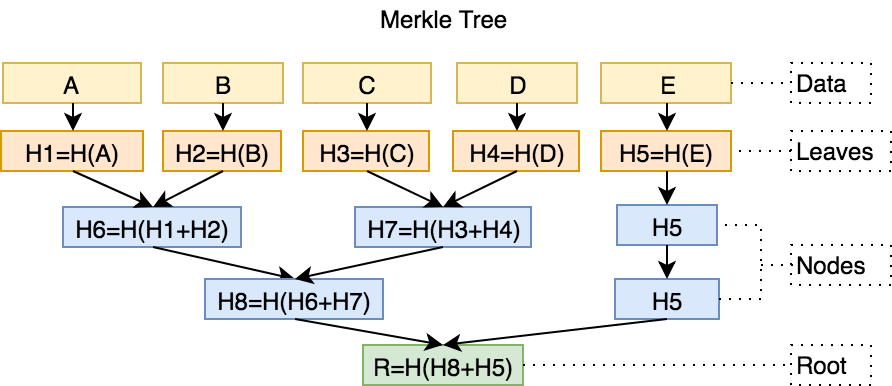

# 快照同步

我们尝试从设计者的角度, 渐进的设计干个快照同步的版本来理解他的机制

## 版本 1

全同步的逻辑很简单, 下载并执行所有的区块, 以获得一颗最新的完整的状态树. 
获得了这颗状态树以后, 就可以轻易的验证并执行新出的区块.

既然下载, 执行这么多区块, 只是为了获得一颗最新的状态树, 而且执行新区块的时候, 历史的区块信息也用不到, 为什么不直接下载一个最新的状态树呢?

于是有了快照同步版本 1:

1. 链接到多个节点, 下载最新的一个区块头, 确保这个区块不会是伪造的
2. 获取最新的状态树的根节点的哈希, 也就是最新的区块头中的 stateRoot
3. 根据 stateRoot 从远程节点查询节点的内容, 再递归查询节点的子节点, 如此往复, 直到同步完成
4. 校验新的状态树的根和区块头中的是否一致

## 版本 1.1

不对, 似乎忘了一件事 `╮(￣▽￣)╭` , 执行新区块的时候, 如果区块中有交易调用了合约, 
还需要相应的合约的字节码才能执行, 要知道合约字节码并不是存在状态树里的. 
要下载合约字节码也不难, 获取完整的状态树后, 就可以知道哪些账户有合约字节码, 哪些没有了, 
根据账户里的 `codeHash` 去远程节点下载字节码就行. 
只要状态树合法, 这一步是无法作恶的, 只需要检查下载得到的字节码的哈希和 `codeHash` 是否一致

于是有在版本 1 的基础上再加一步:

5. 根据每个账户的 `codeHash` 去远程节点下载合约字节码

## 版本 2

然而看似没什么问题的版本 1.1 有一个巨大的 bug, 如果任意一个远程节点作恶, 返回了伪造的数据, 
导致了我们在第 4 步校验时发现我们同步得到的状态树的根和区块头中的不一致, 怎么办? 
不一致也就算了, 我们甚至不知道那些数据是合法的, 哪些是非法的, 应该重新下载哪些

最好找到一种办法, 在下载节点数据的时候, 就可以验证他的合法性. 
介于状态树是一个可验证的 [MPT](./merkle-patricia-tree.md) 树, 实现这一点好像也不难

于是有了快照同步版本 2:

1. 链接到多个节点, 下载最新的一个区块头, 确保这个区块不会是伪造的
2. 获取最新的状态树的根节点的哈希, 也就是最新的区块头中的 stateRoot
3. 根据 stateRoot 从远程节点查询节点的内容, 再递归查询节点的子节点, 如此往复, 直到同步完成 
   (远程节点在返回节点内容时, 同时生成一段证明, 让本地节点校验)
4. 校验新的状态树的根和区块头中的是否一致
5. 根据每个账户的 `codeHash` 去远程节点下载合约字节码

## 版本 3

上个版本可行, 但效率好像低了一点, 低在三个部分:

1. 状态树是一颗非常庞大的树, 树越大, 默克尔证明也越大. 
   这会导致即使我们下载的只是单个节点, 他的默克尔证明的也会非常庞大, 这样看起来不怎么划算
2. 遍历一颗状态树的成本太高了, 状态树的结构本来就不是为了遍历而设计的, 
   这个树里面有多少节点就要查询多少次, 而且每次查询都需要 RLP 解码
3. 一个个查询节点, 然后再递归查询, 查询效率貌似很低, 最好可以批量查询

**对于问题 1**

假设有如下默克尔树

要证明 B, 需要 H1, H7, H5 
要证明 D, 需要 H6, H3, H5 
要证明 C, 需要 H6, H4, H5 
可以发现, 如果我们已经拥有了 B 和 D 的证明, C 自然就被证明了, 
因此, 如果我们是批量请求节点, 并且这些节点是连续的, 那么只需要获得第一个和最后一个节点的证明, 而不是所有节点的证明. 

当然, 也有些特殊情况

- 当目标根节点没有子节点时, 需要给出空的证明
- 当批量请求的范围覆盖所有子节点时, 不需要任何证明, 因为本地节点可以直接用所有节点计算出根的哈希, 来检查是否合法
- 当批量请求的范围包含根节点下第一个子节点或最后一个子节点时, 只需要一份头或者尾的证明 
  比如当请求范围是 A - C 时, 只需要提供 C 的证明, 当请求范围是 C - E 时, 也只需要提供 C 的证明

**对于问题 2**

参考以太坊中[区块头的存储形式](./ethereum-database.md) 
如果我们想不依靠 `numberToHash` 索引遍历所有区块的话, 可以使用 leveldb 提供的迭代功能, 
迭代键的范围是从 `'h' + 0000000000000000000000000000000000000000000000000000000000000000` 到  
`'h' + ffffffffffffffffffffffffffffffffffffffffffffffffffffffffffffffff`

可惜状态树不能这样遍历, 因为状态树的键是节点的哈希, 没有一个固定的前缀

但如果我们先遍历一遍状态树, 然后为每个账户一个副本, 键为 `'a' + account hash`, 值为账户的 RLP 编码, 
再为这个账户的状态树的每一个槽位也创建一个副本, 键为 `'o' + account hash + storage hash`, 值就是这个槽位对应的值. 
那状态树也可以用上面那种方法类似的形式遍历

虽然创建副本的成本很大, 不仅遍历状态树要消耗 CPU 与磁盘读写, 而且 leveldb 数据的增长量约等于最新的状态树的总量, 
但以这种方式遍历状态树可比一个个子节点递归查询快多了, 
而且查询每个账户的开销是差不多的, 不会出现通过状态树查询账户的时候开销不可控的情况. 
总的来说靠谱多了

**对于问题 3**

有了以上两个解决方案作为基础, 批量请求也不再是问题了, 
客户端可以在请求时定一个范围, 服务端在查询 leveldb 数据库时, 用客户端制定的范围就可以

于是有了最终版本 3 `(๑•̀ㅂ•́)و`:

1. 服务端遍历状态树, 创建副本
2. 客户端链接到多个节点, 下载最新的一个区块头, 确保这个区块不会是伪造的
3. 客户端获取最新的状态树的根节点的哈希, 也就是最新的区块头中的 stateRoot
4. 客户端查询账户, 给出 stateRoot, startingHash(开始查询的哈希), limitHash(结束查询的哈希), 以及一个 responseBytes 用于限制返回数据的大小
5. 服务端根据 stateRoot 找到对应的快照, 并在 leveldb 里以 `'a' + startingHash` - `'a' + limitHash` 作为范围查询, 
   并返回结果, 同时给出第一个以及最后一个节点的证明(特殊情况下只需要一个证明或者一个都不需要)
6. 客户端验证证明及保存快照
7. 客户端查询每个账户的状态树, 给出 stateRoot, accoutHash, startingHash(开始查询的哈希), limitHash(结束查询的哈希), 以及一个 responseBytes 用于限制返回数据的大小
8. 服务端根据 stateRoot 找到对应的快照, 并在 leveldb 里以 `'o' + accoutHash + startingHash` - `'0' + accoutHash + limitHash` 作为范围查询, 
   并返回结果, 同时给出第一个以及最后一个节点的证明(特殊情况下只需要一个证明或者一个都不需要)
9. 客户端验证证明及保存快照
10. 客户端根据每个账户的 `codeHash` 下载合约字节码
11. 服务端根据 `codeHash` 查询字节码并返回
12. 客户端验证字节码并保存
13. 客户端根据快照恢复出完整的状态树

以上步骤只是为了方便理解, 实际上下载账户, 账户状态树, 合约字节码是可以并行的, 因为针对每个返回, 都可以单独验证

# 其他

- 快照同步的 p2p 通信协议叫做`SNAP`, 具体在[这里](https://github.com/ethereum/devp2p/blob/master/caps/snap.md)

- 不可能对每个高度都创建一次副本, 那样的话成本太高了. 
  解决方案是, 每次执行区块时, 记录所有改动过的账户以及账户状态树的槽位, 生成一个对象, 然后将这个对象与之前的副本合并
